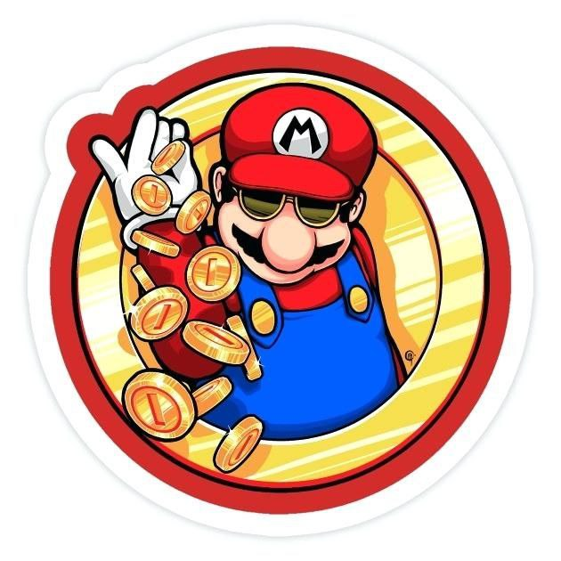

 

    
  </a>

  <h3 align="center">MarioBrosCoin</h3>

  

    Welcome to the MarioBrosCoin Github Page!
     
  

  

  <b>Links:</b>
   
  <a href="https://www.mariobros.info/">MarioBrosCoin Website</a> |
  <a href="https://v1exchange.pancakeswap.finance/#/swap?outputCurrency=0x25f6524c2bfa5eebcc50beafd08525e0786082cf">Buy On Pancakeswap</a> |
  <a href="https://poocoin.app/tokens/0x25f6524c2bfa5eebcc50beafd08525e0786082cf">Live Chart</a>
     
  <b>Contract Address:</b> 0x25f6524c2bfa5eebcc50beafd08525e0786082cf
     
    <h4 align="center">Audit Comments</h4>
      
 

In regards to the audit, one of the places we've talked to about getting it audited is requesting minimum of $2000.

After reviewing the code and comparing it with previous reviews that company has done, our code seems to be identical as those that have passed audit checks. With the benefit being our highest wallets being below 3% which means no one or few holders can just dump the coin on the rest of the holders and run off.

Details of these comparisons can be viewed in the Audit Comparison directory.

**Note this project is a SafeMoon clone and the original code can be viewed here: 
<a href="https://github.com/safemoonprotocol/Safemoon.sol/blob/main/Safemoon.sol">View SafeMoon Code</a>

